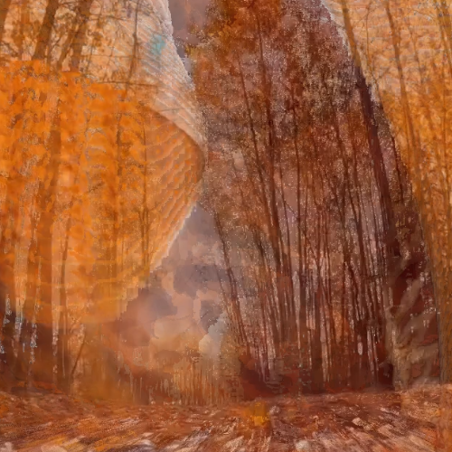

# Sticky Frame - Video Trail Effect

A simple command-line application written in Rust to create a "sticky frame" or "burn-in" motion trail effect on videos. It works by comparing consecutive frames and leaving a trail for pixels that change significantly.

### Demo
| Before | After |
| :----: | :---: |
| [](assets/demo_input.mp4) | [](assets/demo_output.mp4) |
| *Click to play original video* | *Click to play processed video*|

Settings used for Demo:
```rust
let burn_in_factor: f32 = 0.4;
let diff_r_threshold_percent: f32 = 0.1;
let diff_g_threshold_percent: f32 = 0.1;
let diff_b_threshold_percent: f32 = 0.1;
let preserve_audio: bool = true;
```

## Features

-   **Motion Trail Effect**: Creates a "burn-in" effect for moving objects in a video.
-   **Audio Preservation**: The audio from the original video is automatically merged into the final processed video.
-   **Customizable Settings**: Easily tweak the burn-in factor and color sensitivity thresholds directly in the source code.
-   **Console Progress Bar**: Shows processing progress, including ETA, in the console.

## Prerequisites

Before running this project, you must have the following installed:

1.  **Rust and Cargo**: [https://www.rust-lang.org/tools/install](https://www.rust-lang.org/tools/install)
2.  **FFmpeg**: This is required for merging the audio back into the processed video. You can download it from [https://ffmpeg.org/download.html](https://ffmpeg.org/download.html). Make sure it's accessible from your system's PATH.

## How to Use

1.  **Clone the repository:**
    ```bash
    git clone https://github.com/BlankyWacky/sticky_frame
    cd sticky_frame
    ```

2.  **Add your video:**
    Place the video you want to process into the root of the project directory and name it `input.mp4`.

3.  **Configure the effect (optional):**
    Open `src/main.rs` and modify the values in the `Effect Settings` section to your liking.

4.  **Run the program:**
    Execute the following command in your terminal:
    ```bash
    cargo run --release
    ```
    This will build and run the application in release mode for optimal performance.

5.  **Get the result:**
    The final video, including audio, will be saved as `output.mp4` in the project root.

## Configuration

You can customize the video effect by changing these variables at the top of the `main` function in `src/main.rs`:

-   `burn_in_factor: f32`: Controls how much of the new pixel is blended into the canvas when a change is detected.
    -   `1.0` (100%): The new pixel completely replaces the old one, creating a sharp trail.
    -   `0.0` (0%): No change occurs.
    -   Values in between create a blended, semi-transparent trail.

-   `diff_..._threshold_percent: f32`: This is the sensitivity for the change detection for each color channel (Red, Green, Blue), as a percentage.
    -   `0.2` (20%) is a good starting point.
    -   Lower values (e.g., `0.1`) are more sensitive and will detect smaller changes, resulting in longer trails.
    -   Higher values (e.g., `0.5`) are less sensitive and will only burn in very significant changes.

## License

This project is licensed under the MIT License. You can add a `LICENSE` file with the MIT License text if you wish.
